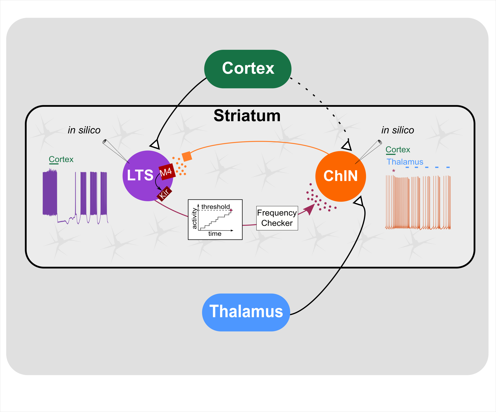

## Multi-scale Analysis and Simulation in Neuroscience 

### Microcircuit in silico 

Multi-scale simulation of striatum and multi-scale simulation tool, Snudda. 
Expand into the nuclei of Basal Ganglia and the neuromodulation.

[Snudda](https://github.com/Hjorthmedh/Snudda) By Johannes Hjorth

### Neuromodulation 

Simulation of ion channel modulation following neuromodulation. 

* [Dopamine](https://github.com/Hjorthmedh/Snudda) By Johannes Horth
* [Acetylcholine](https://github.com/jofrony/ChIN-LTS-Network-simulation) By Johanna Frost Nylen (jofrony)
* [Nitric oxide](https://github.com/jofrony/ChIN-LTS-Network-simulation) By Johanna Frost Nylen (jofrony)

Graphical abstract from Frost Nylen et al 2020 

#### Presynaptic and postsynaptic modulation of corticostriatal input

We simulate modulation of presynaptic input following dopamine transients and its effects on striatal processing 
[Presynaptic] (https://github.com/Hjorthmedh/Snudda).

### Publications

Frost Nylén, J, Carannante, I, Grillner, S, Hellgren Kotaleski, J. Reciprocal interaction between striatal cholinergic and low‐threshold spiking interneurons — A computational study. Eur J Neurosci. 2020; 00: 1– 14. https://doi.org/10.1111/ejn.14854

J. J. Johannes Hjorth, Alexander Kozlov, Ilaria Carannante, Johanna Frost Nylén, Robert Lindroos, Yvonne Johansson, Anna Tokarska, Matthijs C. Dorst, Shreyas M. Suryanarayana, Gilad Silberberg, Jeanette Hellgren Kotaleski, Sten Grillner Proceedings of the National Academy of Sciences Apr 2020, 117 (17) 9554-9565; DOI: 10.1073/pnas.2000671117
